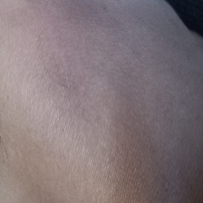
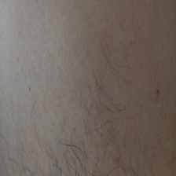
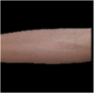
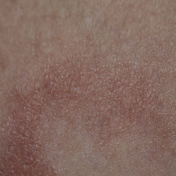
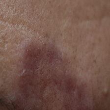
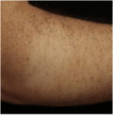

# Hanseníase - Diagnóstico da Forma Indeterminada através de Imagens com Deep Learning.

#### Aluno: [Flavio Amorim](https://github.com/flamorim)
#### Orientador: [Evelyn Batista](https://github.com/https://github.com/evysb)

---

Trabalho de conclusão do curso [BI MASTER](https://ica.puc-rio.ai/bi-master).

- [Link para o código](https://github.com/flamorim/Leprosybyimage).

---

Resumo: A proposta deste trabalho é apresentar um modelo de inteligência artificial, capaz de suportar dermatologistas no diagnóstico da Hanseníase Indeterminada, através de análise de imagens. Foi desenvolvido um backbone em Deep Learning, baseado em rede Convolucional, com a tarefa de classificação, fazendo a predição de probabilidade de uma imagem indicar Hanseníase Indeterminada ou não.

Abstract. The purpose of this work is to present an artificial intelligence model, capable of supporting dermatologists in the diagnosis of Indeterminate Leprosy, through image analysis. A backbone was developed in Deep Learning, based on a Convolutional network, with the task of classification, that predicts the probability of an image having Indeterminate Leprosy.

 

### 1. Introdução

O reconhecimento de padrões visuais é uma habilidade fundamental em diagnósticos em dermatologia e a IA pode fornecer suporte à análise de imagens e melhorar a precisão diagnóstica dentro desse campo.

A hanseníase indeterminada é aquela onde os sintomas de pele começam se manifestar sem ser possível determinar há quanto tempo o paciente contraiu o bacilo. A hanseníase tuberculóide é a evolução da hanseníase indeterminada, onde os sintomas de pele se intensificam podendo acontecer queda de pelos e nódulos.

Este estudo é orientado para o diagnóstico da hanseníase indeterminada.

Seguem duas imagens para exemplo:

Fig1 - Hanseniase Indeterminada

Fig2 - Hanseníase Tuberculóide

### 2. Dataset

As imagens com hanseníase foram obtidas do dataset [AI4leprosy](https://arcadados.fiocruz.br/dataset.xhtml?persistentId=doi:10.35078/1PSIEL), mantido pelo laboratório de Hanseníase da [Fundação Oswaldo Cruz, ](https://dadosdepesquisa.fiocruz.br/dataverse/hanseniase). Nesta ocasião ele possuia 1231 imagens de alta-resolução de lesões na pele diagnosticadas com hanseníase, mas infelizmente nem todas foram possíveis de serem utilizadas. Muitas eram relativas à hanseníase tuberculóide, algumas eram duplicadas e no final foram selecionadas 434 imagens.

Para imagens sem hanceníase, foram obtidas somente 38 [imagens](images/sem-hanseniase) e, para evitar um desbalanceamento maior, após alguns ajustes do modelo, trabalhou-se com 141 imagens com hanseníase. Desta forma, o dataset do projeto ficou com 176 imagens.

Foi utilizado a técnica de data augmentation, onde a quantidade de amostras do conjunto de dados é virtualmente aumentada diversificando os dados, evitando o overfitting e compensando o custo envolvido na coleta de mais dados.

### 3. Modelo

Foi escolhida a Rede Neural Convolucional (CNN), que é uma classe especial de redes Deep Learning com a capacidade de extrair recursos exclusivos de dados de imagem.
Uma rede CNN pode ter seus pesos ajustados durante o processo de aprendizado, ou pode-se utilizar arquiteturas pré-treinadas que foram desenvolvidas e disponibilizadas publicamente, com pesos já ajustados (geralmente a partir de uma base de dados mais abrangente). Nesse caso, é preciso adaptá-la e ajustá-la de acordo com a aplicação desejada.

Dentre estas redes pré-treinadas disponíveis, foi escolhida a [CNN VGG16](https://storage.googleapis.com/tensorflow/keras-applications/vgg16/vgg16_weights_tf_dim_ordering_tf_kernels_notop.h5) pré treinada com seus pesos congelados e inserida uma nova head para a tarefa de classificação com uma saída sigmoid.

O treinamento foi feito em duas etapas e dividindo a base de amostras na proporção de 80% para treinamento e 20% para teste. A primeira foi com 20 épocas, onde foi obtido uma acurácia de 88%.  A segunda, um fine tunning descongelando toda a rede e treinando-a novamente com apenas cinco épocas e reduzindo  o learning rate, antes de 0,005 para 0,001. Embora o score tenha aumentado um pouco, a acurácia praticamente  se manteve a mesma, indicando que não houve uma melhora significativa nesse fine-tunning. A tabela abaixo ilustra os resultados do treinamento:
<table>
  <tr>
    <th>Etapa</th>
    <th>Épocas</th>
    <th>Score</th>
    <th>Acurácia</th>
  </tr>
  <tr>
    <td>1</td>
    <td>20</td>
    <td>0,3507</td>
    <td>0,8865</td> 
  </tr>
  <tr>
    <td>2</td>
    <td>5</td>
    <td>0,4258</td>
    <td>0,8842</td> 
  </tr>
 
</table>

### 4. Resultados

A saída da rede proposta é através de softmax, e assim temos um valor entre 0 e 1, onde quanto mais próximo de 0 indica a sintomas hanseníase indeterminada e quanto mais próximo de 1 ausência destes sintomas.

Segue abaixo imagens de onde foram feitas inferências, com comhecimento prévio da ausência de hanseníase indeterminada, e suas respectivas predições calculadas pelo modelo:

Fig3 - Predição = 0,68

Fig4 - Predição = 0,97

Fig5 - Predição = 0,86

Segue abaixo imagens de onde foram feitas inferências, com comhecimento prévio da presença de hanseníase indeterminada, e suas respectivas predições calculadas pelo modelo:

Fig6 - Predição = 0,37

Fig7 - Predição = 0,23

Fig8 - Predição = 0,41

### 5. Conclusão

No Brasil, a hanseníase ainda se constitui em um problema de saúde pública o que exige uma vigilância resolutiva. O estudo permitiu observar que Deep Learning pode auxiliar fortemente os dermatologistas no diagnóstico da Hanseníase Indeterminada e que consequentemente também prevenirá a ocorrência das formas mais graves da Hanseníase.
Esse estudo pode evoluir e utilizar mais imagens em seu treinamento, o que aperfeiçoará sua capacidade de reconhecer os sinais da Hanseníase Indeterminada. Também podem ser introduzidas outras classes de imagens, como doenças de pele, cicatrizes ou feridas para também ensinar ao modelo de deep learning outras manifestações na pele diferentes da Hanseníase.

---

Matrícula: 211.100.510

Pontifícia Universidade Católica do Rio de Janeiro

Curso de Pós Graduação *Business Intelligence Master*

